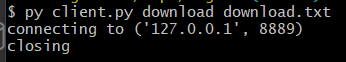

# Tugas 4

## Cara Kerja

Pertama jalankan file [server.py](server.py). Kemudian buka command prompt atau terminal. Jalankan perintah berikut

```
py client.py [parameter]
```

**Parameter** tersebut dapat diisi dengan 3 format tergantung dengan apa yang ingin dilakukan.

1. Download  
    Jika ingin mendownload, gunakan parameter

    ```
    download [nama file]
    ```  
    kemudian file server akan mengirimkan isi file tersebut ke client sehingga program dapat menyimpan isi file tersebut.

2. Upload  
    Jika ingin mengupload, gunakan parameter
    ```
    upload [nama file]
    ```
    kemudian program akan secara otomatis mengubah parameter diatas menjadi seperti dibawah untuk dikirimkan ke server.
    ```
    upload [nama file] [isi file]
    ```  
    setelah itu server akan menerima dan menyimpan data yang telah dikirim oleh client.

3. List  
    Jika ingin melihat file apa saja yang terdapat di dalam folder "file", gunakan paramater
    ```
    list
    ```  
    kemudian server akan mengirimkan sebuah JSON ke client untuk ditampilkan.

### Respon Client

1. Respon download  
  


2. Respon upload  
  


3. Respon list  
  
