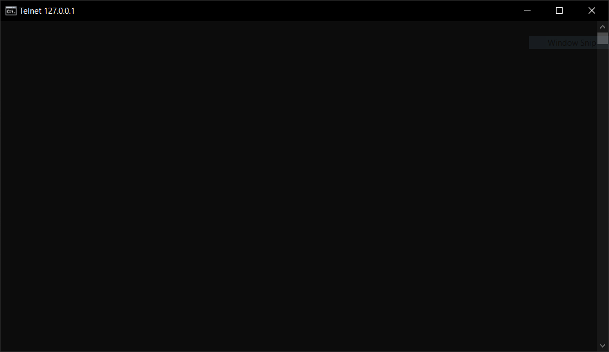
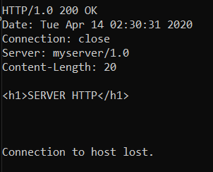
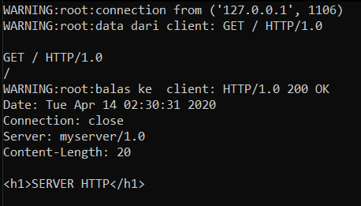
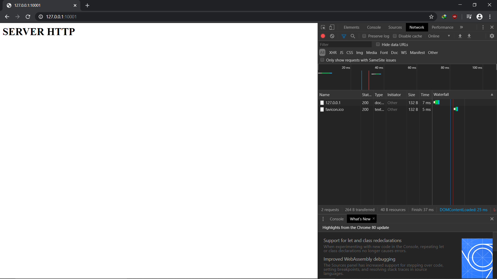
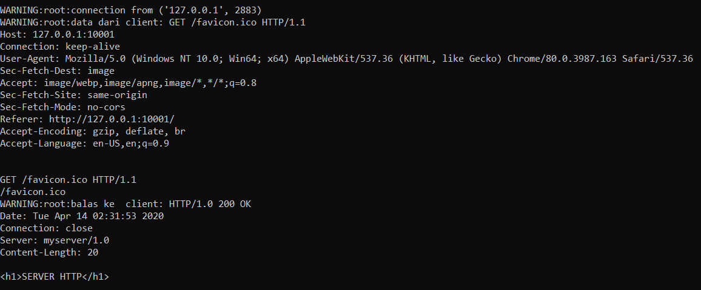
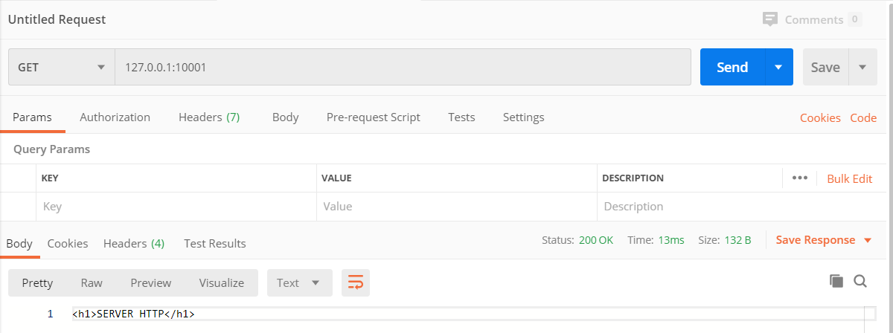
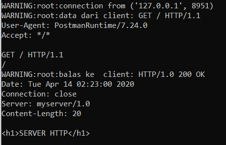

# Tugas 6

## Melakukan telnet ke 127.0.0.1 port 10001 dari command prompt

## Melakukan request dengan telnet

## Respon server terhadap request dari telnet

## Melakukan request dengan browser chrome

## Respon server terhadap request dari browser chrome

## Melakukan request dengan postman

## Respon server terhadap request dari postman

