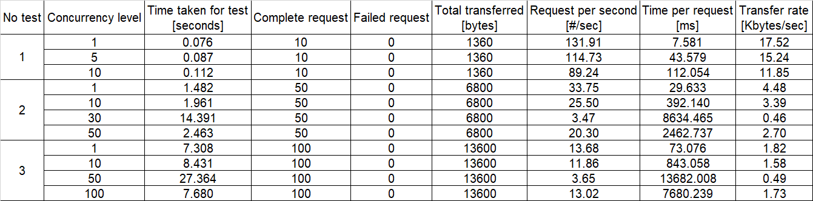
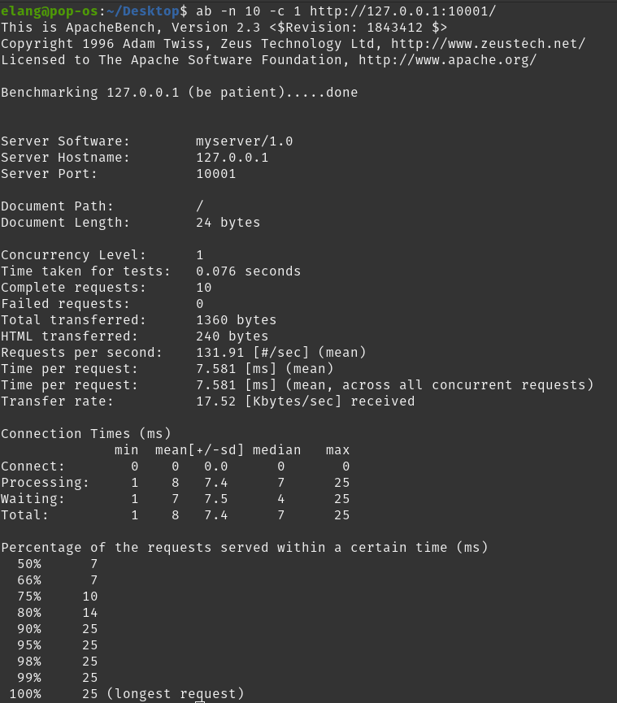
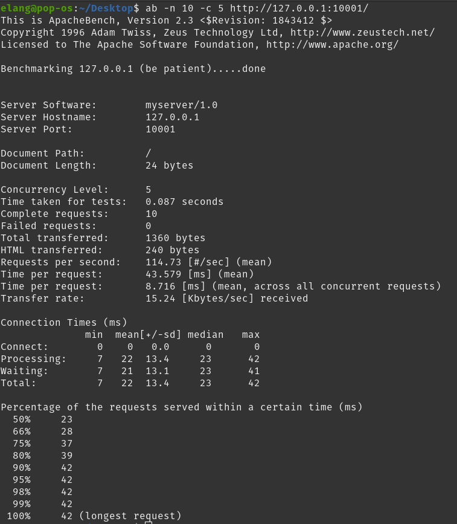
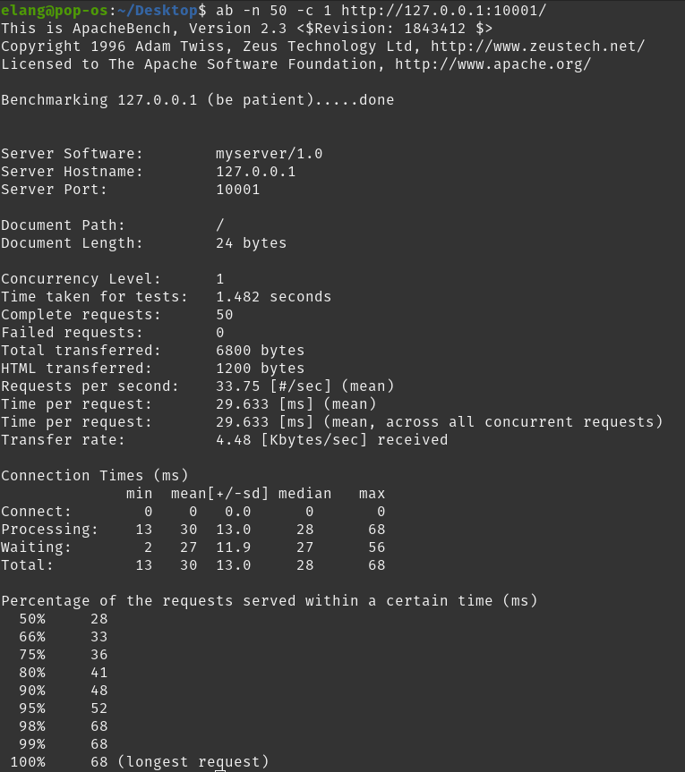
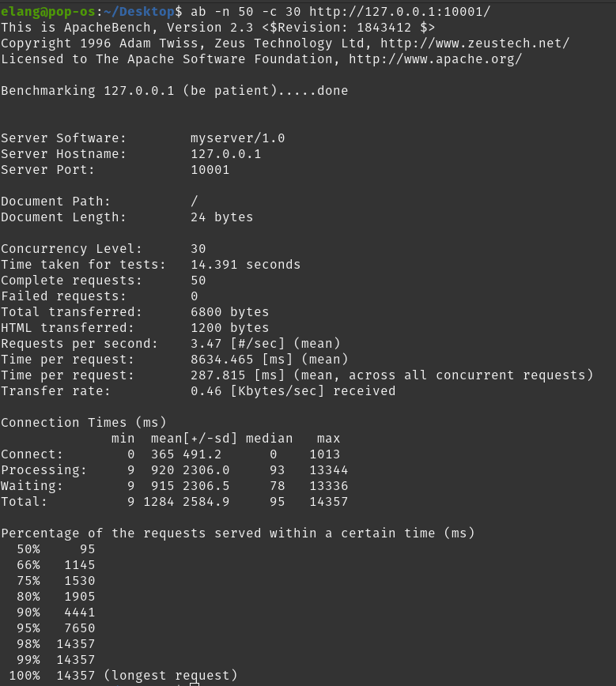
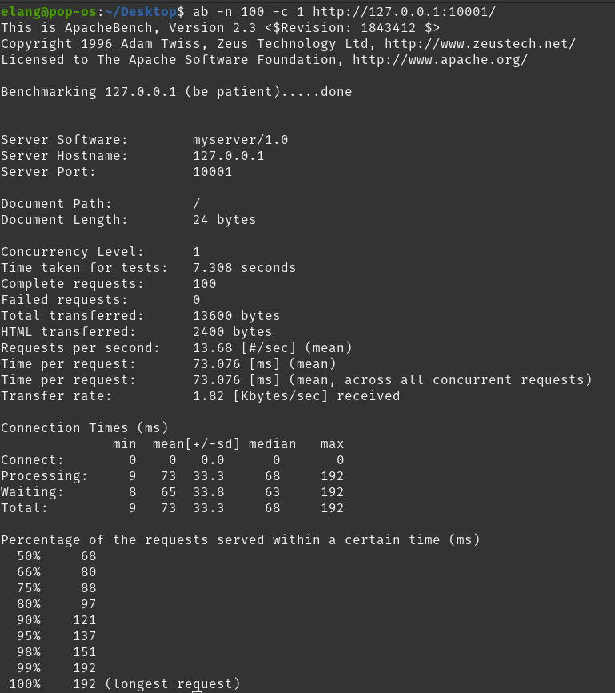
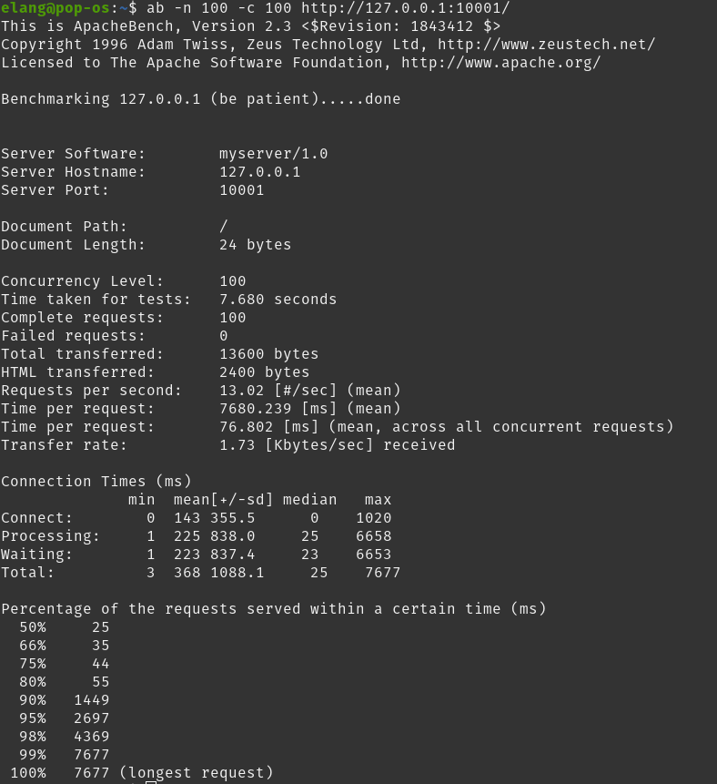

# Tugas 7

## Tabulasi hasil benchmark performance test
  

## Hasil benchmark dengan melakukan request sebanyak 10:
### Dengan Concurrency Level 1

### Dengan Concurrency Level 5

### Dengan Concurrency Level 10
  

## Hasil benchmark dengan melakukan request sebanyak 50:
### Dengan Concurrency Level 1

### Dengan Concurrency Level 10

### Dengan Concurrency Level 30

### Dengan Concurrency Level 50
  

## Hasil benchmark dengan melakukan request sebanyak 100:
### Dengan Concurrency Level 1

### Dengan Concurrency Level 10

### Dengan Concurrency Level 50

### Dengan Concurrency Level 100
