# Tugas 8

## Sebelum Modifikasi
Sebelum program di modifikasi, ketika membuka halaman http://127.0.0.1:10002/sending.html dan server menerima sebuah POST request dari web browser maka server akan merespon dengan mengirim string "kosong" dan  kemudian web browser akan menampilkan string "kosong" tersebut.
### Sebelum mengirim POST request.

### Setelah mengirim POST request.
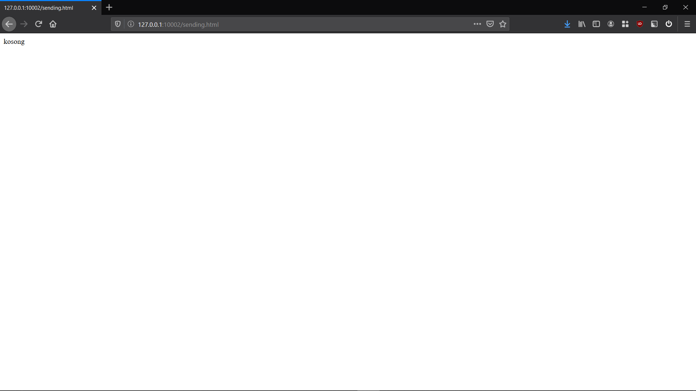

### Respon dari server.
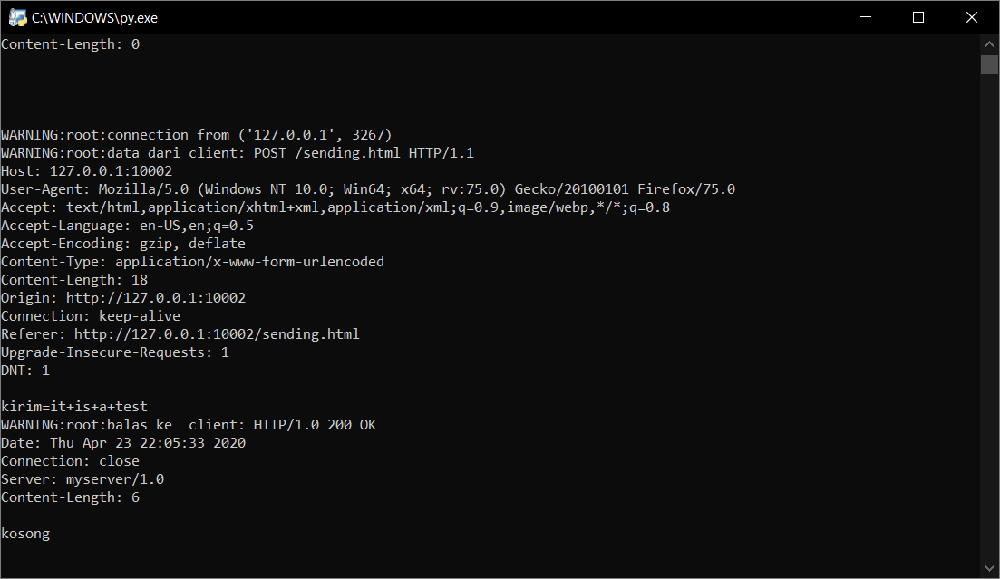  

   

## Setelah Modifikasi
Setelah program di modifikasi, ketika membuka halaman http://127.0.0.1:10002/sending.html dan server menerima sebuah POST request dari web browser maka server akan merespon dengan mengirim kembali string yang telah di-input dan  kemudian web browser akan menampilkan string yang telah di-input tersebut. Server juga mengirimkan kembali semua header yang diterima oleh server saat web browser mengirimkan POST request kepada server.
### Sebelum mengirim POST request menggunakan web browser Mozilla Firefox.

### Setelah mengirim POST request menggunakan web browser Mozilla Firefox.
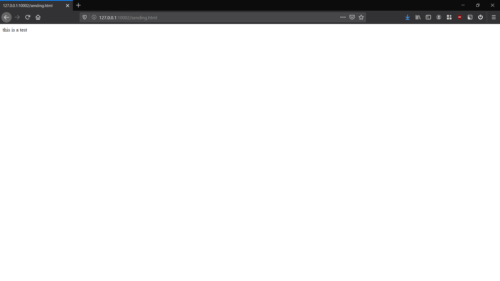

### Respon dari server ketika menggunakan web browser Mozilla Firefox.
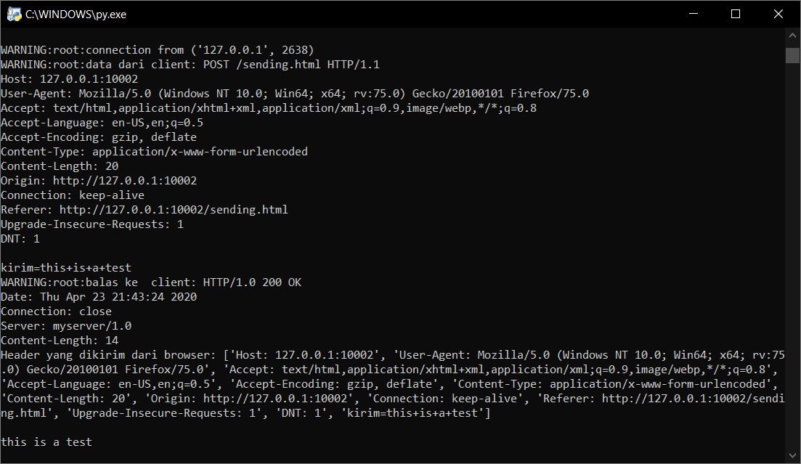  

   

### Sebelum mengirim POST request menggunakan web browser Google Chrome.
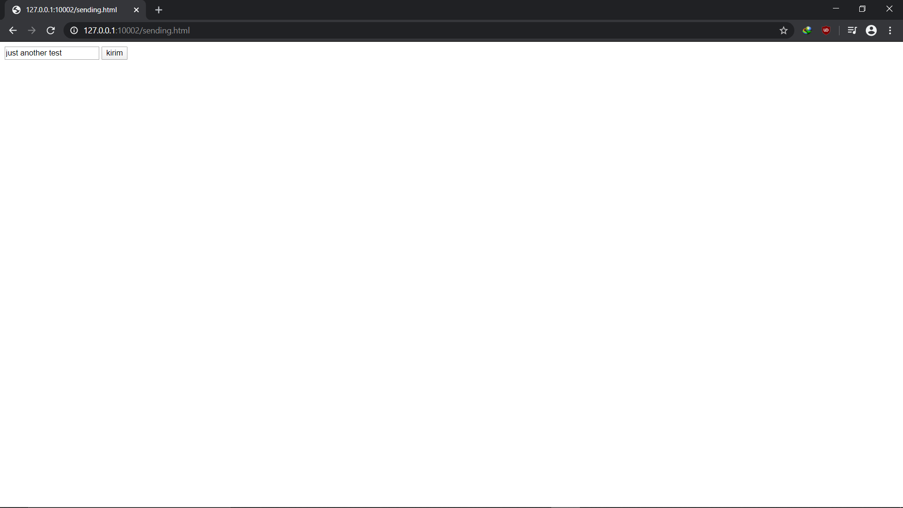

### Setelah mengirim POST request menggunakan web browser Google Chrome.

### Respon dari server ketika menggunakan web browser Google Chrome.
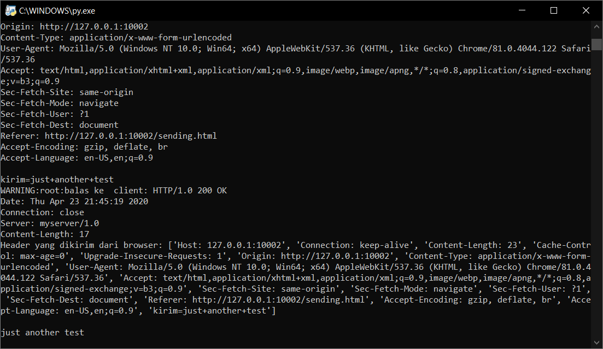  
  
   

### Sebelum mengirim POST request menggunakan web browser Microsoft Edge.
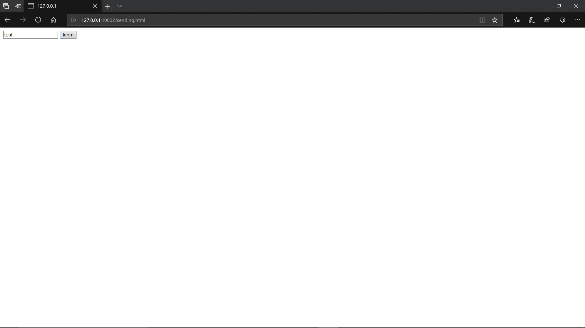

### Setelah mengirim POST request menggunakan web browser Microsoft Edge.
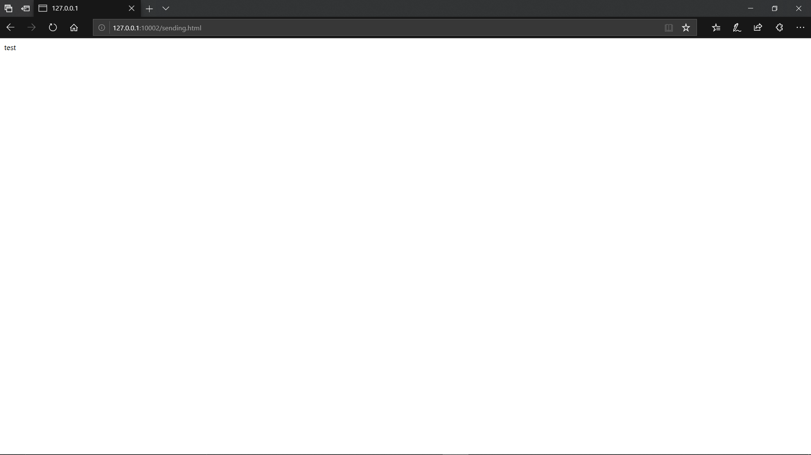

### Respon dari server ketika menggunakan web browser Microsoft Edge.
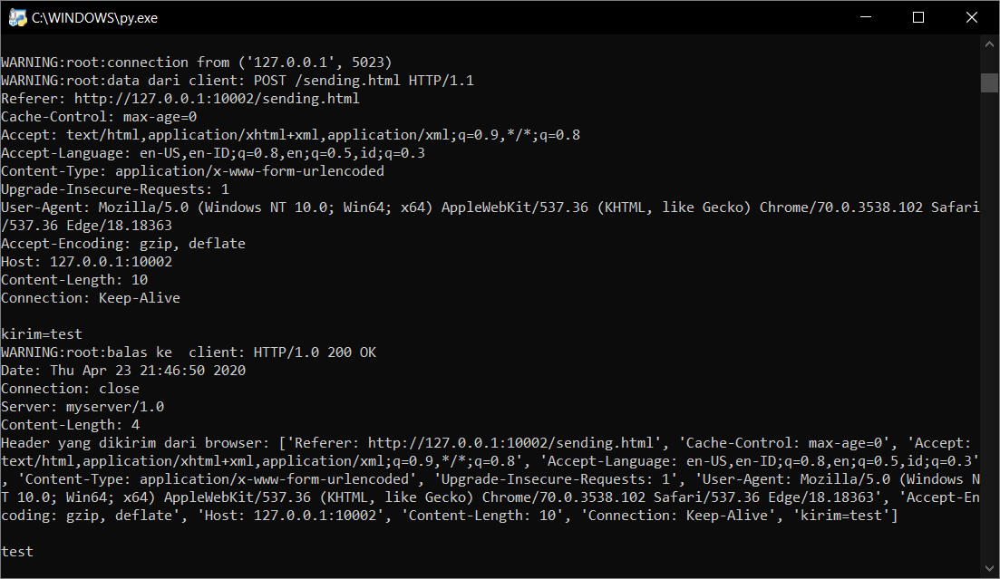  

   

### Sebelum mengirim POST request menggunakan web browser Internet Explorer.
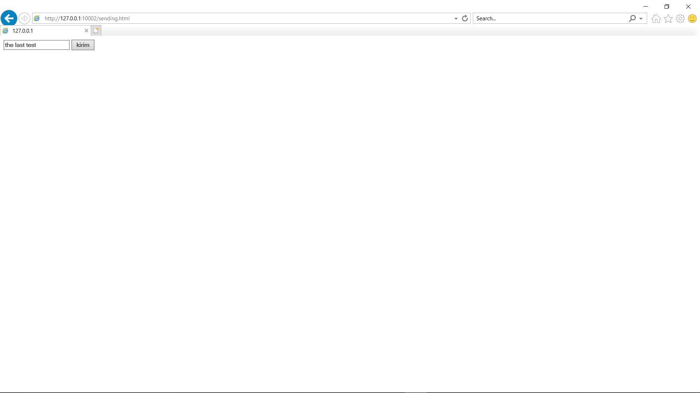

### Setelah mengirim POST request menggunakan web browser Internet Explorer.
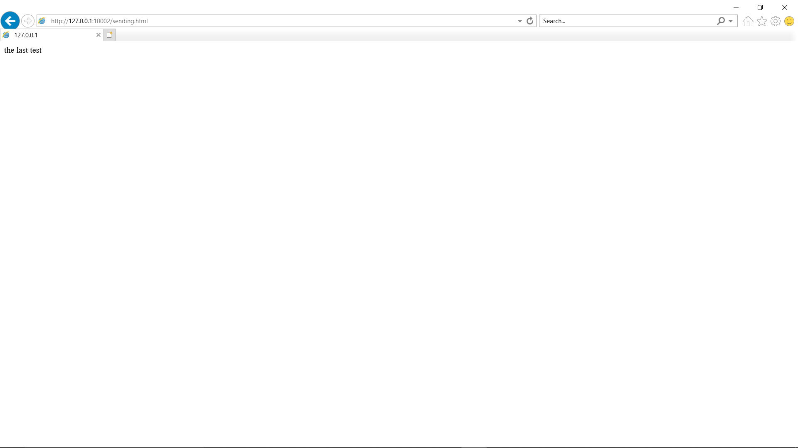

### Respon dari server ketika menggunakan web browser Internet Explorer.
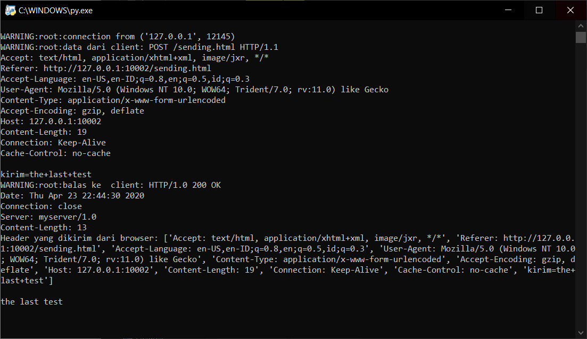  